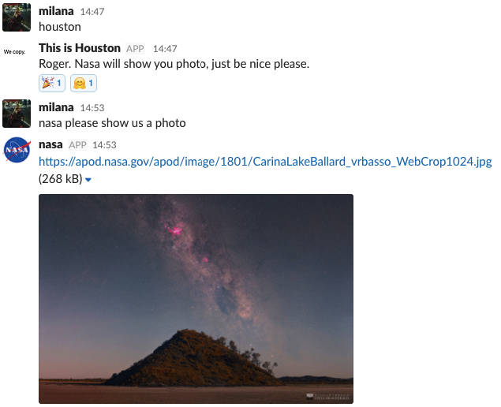

[](https://semaphoreci.com/mstojadinov/nasa)

## Simple Slack Bot - NASA

It uses NASA's most API [APOD].

### Development

While making it I've used Slack's tutorial for [making bots with Ruby](https://github.com/slack-ruby/slack-ruby-bot/blob/master/TUTORIAL.md "Slack-Ruby-Bot Tutorial").

### Running a bot locally

ToDo

```bash
foreman start
```

### Deploying bot to Heroku

- [ToDo] Configure Heroku toolbelt locally
- From the comfort of your terminal create new app on Heroku

    ```bash
    heroku create <app-name>
    ```
- Add environment variables to this app with commands similar to the following.
We'd like to execute this for every variable listed in our `.env` file.

    ```bash
    heroku config:add ENV_VAR_NAME=<its-value>
    ```

- Deploy it by running the following command locally

    ```bash
    git push heroku master
    ```
https://nasa-apod-bot.herokuapp.com/

### Set up an automatic deployment on Semaphore

If we set up [Semaphore server] for the master branch,
our application will automatically be deployed to Heroku after every green build on master.
Additionally, we can enabled Semaphore's [Scheduled Builds] for this branch.

### Wake up Heroku Dyno

[Heroku Dyno] is a lightweight container. When your app is using Heroku free tier
it gets very tired Dyno, which goes to sleep after 30 mins of inactivity.

To entertain a Dyno, I use cURL and Semaphore's [Scheduled Builds].

```bash
if [ "$BRANCH_NAME" = "rise-and-shine-heroku" ]; then curl https://nasa-apod-bot.herokuapp.com/; fi
```

### Wake up Dyno with an outgoing webhook in Slack

On the other hand, we can ping our Heroku application by typing a chosen word.
For example, I've created one [Outgoing WebHook] which listens for triggers in Slack chat messages.
This way, when a trigger is noticed, Slack will send relevant data to external URL(s) in real-time.

#### Configure webhook

To wake up the application, I've decided to create an [Outgoing WebHook].
In order to achive that,  I've:

- filled the URL box with the URL of deployed application on Heroku
`https://nasa-apod-bot.herokuapp.com/houston`
- specified trigger word `houston`

When `nasa` is inactive on Slack it will ignore every picture request.
Then I just type `houston` :)



On a side note, this page lets us to customize some webhook's details
(e.g. `Name`, `Icon`, select `Slack channel(s)`)

#### Verify if request is known

Webhook page from above also shows the `token` which is included in every outgoing playload.
This lets me to verify that a post request came from my Slack team.
At the momment, logic for this lives in the `web.rb` file.

```ruby
return if params[:token] != ENV["SLACK_WEBHOOK_TOKEN"]
```

### Trivia

> Houston, we've had a problem.

Sentence coined by NASA astronaut [Jack Swigert](https://www.jsc.nasa.gov/Bios/htmlbios/swigert-jl.html),
best known as the command module pilot aboard [Apollo 13](https://history.nasa.gov/SP-350/ch-13-1.html).
Here is one [awesome project](http://spacelog.org/) if you'd like to read stories about the early space exploration.

[APOD]: https://api.nasa.gov/api.html#apod
[making bots with Ruby]: https//github.com/slack-ruby/slack-ruby-bot/blob/master/TUTORIAL.md
[Semaphore server]: https://semaphoreci.com/docs/deploying-to-heroku.html
[Scheduled Builds]: https://semaphoreci.com/docs/scheduling-builds.html
[Heroku Dyno]: https://www.heroku.com/pricing
[Outgoing WebHook]: https://slack.com/services/new/outgoing-webhook
